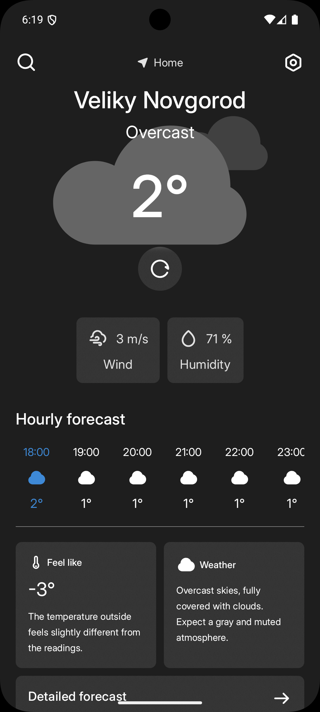
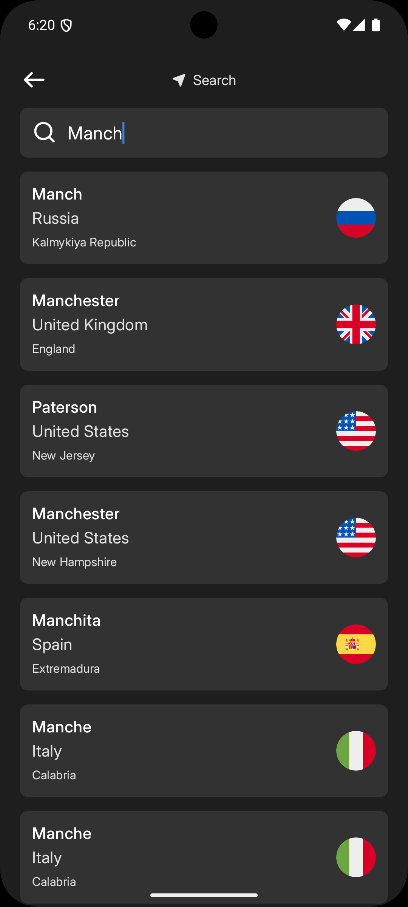
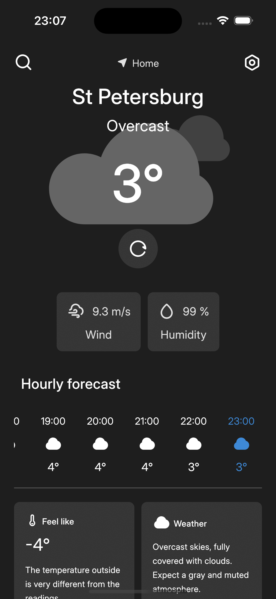
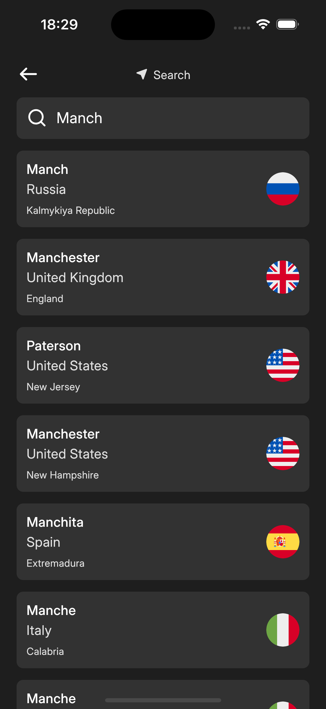
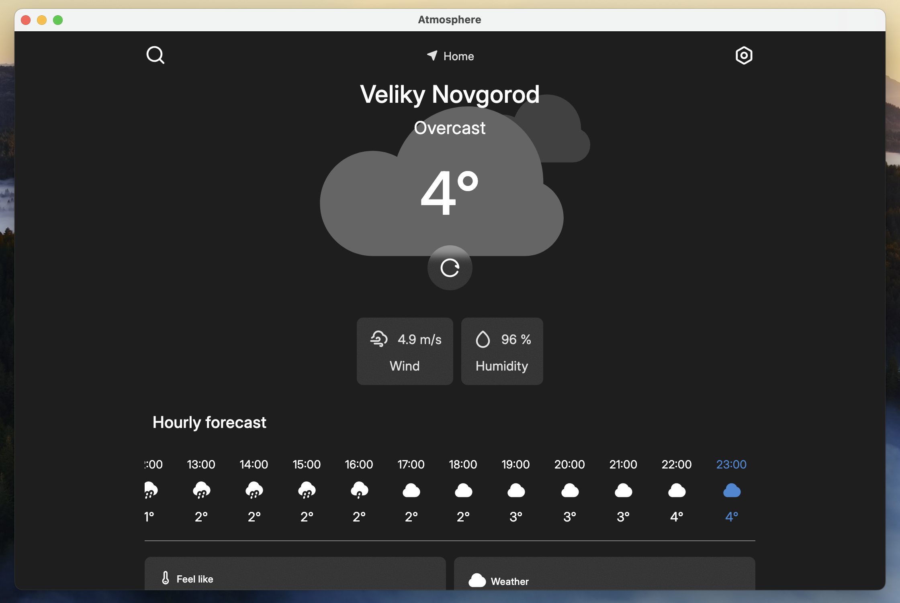
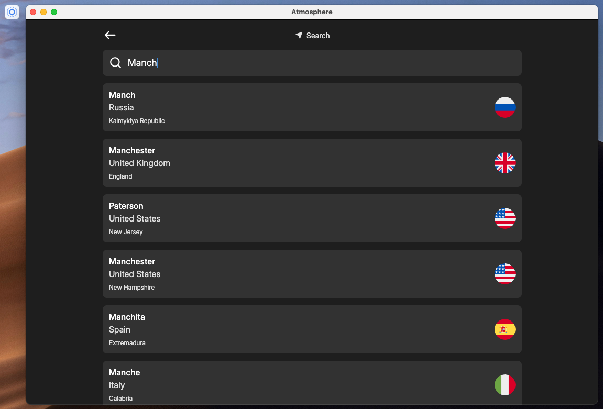

# 🌤️ Atmosphere App
Atmosphere is a cross-platform weather forecasting application developed on Kotlin Multiplatform and Compose Multiplatform. The app provides up-to-date weather information and a forecast for several days for Android, iOS, and Desktop users.

### 🌟 Features
- **Real-time Weather**: Get current weather conditions for selected city.
- **Multi-day Forecast**: View detailed forecasts for the upcoming days.
- **Search Functionality**: Easily find weather updates for any city worldwide.
- **Cross-Platform Support**: Available on Android, iOS, and Desktop platforms.
- **User-friendly Interface**: Intuitive design for smooth user interaction.

### 📸 Screenshots

Android app

  
  

iOS app

  
  

Desktop app

  
  

### 🛠️ Technologies
- **Development language**: [Kotlin](https://kotlinlang.org/).
- **Frameworks**: [Kotlin Multiplatform](https://kotlinlang.org/docs/multiplatform.html), [Compose Multiplatform](https://www.jetbrains.com/compose-multiplatform/).
- **Navigation**: [Voyager](https://voyager.adriel.cafe).
- **Network**: [Ktor](https://ktor.io).
- **Dependency Injection**: [Koin](https://insert-koin.io).

### 🙏 Acknowledgements
- Weather data provided by [Open-Meteo](https://open-meteo.com/).
